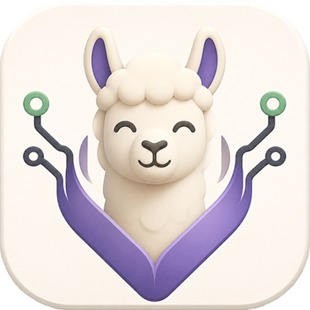

<p align="center">
  
</p>

<h1 align="center">VinoLlama</h1>

<p align="center">
  <strong>Local LLM chat for Intel laptops. Private, fast, and simple.</strong>
</p>

<p align="center">
  <a href="#quick-start">Quick Start</a> |
  <a href="#features">Features</a> |
  <a href="#installation">Installation</a> |
  <a href="#usage">Usage</a> |
  <a href="#configuration">Configuration</a> |
  <a href="docs/API.md">API</a> |
  <a href="docs/PRIVACY.md">Privacy</a>
</p>

<p align="center">
  
  
  
  
  
</p>

---

VinoLlama is a local-first LLM chat tool for Intel laptops and Intel processors. It manages local GGUF models and llama.cpp server processes, preferring the llama.cpp OpenVINO backend with CPU fallback.

- **Local-first**: models, conversations, and logs stay on your machine.
- **Privacy-first**: no telemetry, no cloud sync, no account system, no model upload.
- **Intel-oriented**: prefer OpenVINO acceleration, fall back to CPU automatically.
- **Three interfaces**: CLI, local HTTP API, and desktop GUI.

> VinoLlama is an independent project. It is not affiliated with Intel, OpenVINO, Ollama, or llama.cpp maintainers.

---

## Features

### CLI

| Command                          | Description                           |
| -------------------------------- | ------------------------------------- |
| `vinollama serve`                | Start the local API server            |
| `vinollama run <model>`          | Interactive chat with a model         |
| `vinollama list`                 | List imported models                  |
| `vinollama import <name> <path>` | Import a GGUF model                   |
| `vinollama rm <model>`           | Remove a model manifest               |
| `vinollama ps`                   | Show running model processes          |
| `vinollama stop <model>`         | Stop a running model                  |
| `vinollama doctor`               | Check environment and diagnose issues |

### Desktop GUI

Built with Wails v2, React, TypeScript, and Vite.

- **Chat**: streaming conversations with Markdown and code block support.
- **Models**: import, view, and manage GGUF models.
- **Runtime**: monitor running processes, backends, and runtime state.
- **Settings**: configure host, port, backend, generation defaults, theme, and UI language.
- **Doctor**: environment diagnostics with actionable fix suggestions.
- **Logs**: view recent local runtime logs.
- **Languages**: switch between English and Simplified Chinese in the desktop shell.

### HTTP API

Local-only API at `http://127.0.0.1:11435` with endpoints for chat, generate, models, runtime, settings, conversations, logs, and diagnostics. See [docs/API.md](docs/API.md) for the full contract.

### Backend Management

- **Auto mode**: try OpenVINO first, fall back to CPU with a visible warning.
- **OpenVINO mode**: require a llama.cpp OpenVINO-enabled server binary.
- **CPU mode**: require a llama.cpp CPU server binary.
- Automatic process reuse with idle timeout cleanup.
- Capability detection from local `--help` output; unverified extra flags are opt-in.

---

## Quick Start

### 1. Install

Download a release from [Releases](../../releases), or build from source.

### 2. Configure llama.cpp

Point VinoLlama at local llama.cpp server binaries:

```bash
export VINOLLAMA_LLAMA_CPU_BIN=/path/to/llama-server
export VINOLLAMA_LLAMA_OPENVINO_BIN=/path/to/llama-server-openvino
```

On Windows PowerShell:

```powershell
$env:VINOLLAMA_LLAMA_CPU_BIN = "C:\path\to\llama-server.exe"
$env:VINOLLAMA_LLAMA_OPENVINO_BIN = "C:\path\to\llama-server-openvino.exe"
```

### 3. Import a model

```bash
vinollama import my-model /path/to/model.gguf
```

### 4. Start chatting

```bash
vinollama run my-model
```

Or start the local API:

```bash
vinollama serve
```

---

## Installation

### Build from source

Requirements:

- Go 1.22+
- Node.js 18+
- [Wails v2 CLI](https://wails.io/docs/gettingstarted/installation)

```bash
git clone https://github.com/somnifex/VinoLlama.git
cd VinoLlama

# Build everything: backend tests, frontend checks, and desktop package.
./scripts/build.ps1        # Windows PowerShell
./scripts/build.sh         # Linux / macOS

# Or build the CLI only.
go build -o vinollama.exe ./cmd/vinollama
```

Build script options:

| Flag              | Description                               |
| ----------------- | ----------------------------------------- |
| `--skip-tests`    | Skip Go test suite                        |
| `--skip-frontend` | Skip frontend typecheck, tests, and build |
| `--skip-desktop`  | Skip Wails desktop packaging              |
| `--clean`         | Remove build artifacts before building    |

---

## Usage

### CLI chat

```bash
# Chat with a named model.
vinollama run my-model

# Chat with a GGUF file directly. The file is imported by reference.
vinollama run ./models/qwen2.5-7b-q4_k_m.gguf

# Specify backend and generation parameters.
vinollama run my-model --backend openvino --ctx-size 4096 --threads 8
```

During CLI chat:

- Press Enter to send the current line.
- Press Ctrl+C once during generation to cancel the current turn.
- Press Ctrl+C twice during generation to exit.
- Type `/exit` or `/quit` to exit.

### API server

```bash
vinollama serve --host 127.0.0.1 --port 11435 --backend auto
```

```bash
# Check version.
curl http://127.0.0.1:11435/api/version

# List models.
curl http://127.0.0.1:11435/api/tags

# Chat with NDJSON streaming.
curl -N http://127.0.0.1:11435/api/chat -d '{
  "model": "my-model",
  "messages": [{"role": "user", "content": "Hello"}],
  "stream": true
}'
```

### Desktop GUI

```bash
cd desktop
wails dev
wails build
```

The desktop app connects to the local VinoLlama API at `127.0.0.1:11435`. Start the API server first, or let the desktop app detect and display service status.

---

## Configuration

Default config location:

| Platform | Path                                   |
| -------- | -------------------------------------- |
| Windows  | `%USERPROFILE%\.vinollama\config.yaml` |
| Linux    | `~/.vinollama/config.yaml`             |

```yaml
server:
  host: 127.0.0.1
  port: 11435

runtime:
  backend: auto
  idle_timeout: 10m
  ready_timeout: 30s
  llama_openvino_bin: ""
  llama_cpu_bin: ""
  openvino_device: ""
  internal_port_start: 21435
  health_path: ""
  extra_openvino_args: []
  extra_cpu_args: []
  allow_unverified_flags: false

generation:
  ctx_size: 4096
  temperature: 0.7
  top_p: 0.9
  threads: 0

models:
  directory: ""
  default_import_mode: reference

desktop:
  start_service_on_launch: true
  stop_service_on_exit: false
  theme: system
  compact_mode: false

privacy:
  telemetry: false

logging:
  level: info
  file: ""
```

Environment variables:

| Variable                       | Description                                             |
| ------------------------------ | ------------------------------------------------------- |
| `VINOLLAMA_BACKEND`            | Backend override: `auto`, `openvino`, `cpu`             |
| `VINOLLAMA_HOST`               | HTTP bind host                                          |
| `VINOLLAMA_PORT`               | HTTP bind port                                          |
| `VINOLLAMA_MODELS`             | Model directory                                         |
| `VINOLLAMA_LLAMA_OPENVINO_BIN` | Path to llama.cpp OpenVINO server binary                |
| `VINOLLAMA_LLAMA_CPU_BIN`      | Path to llama.cpp CPU server binary                     |
| `VINOLLAMA_OPENVINO_DEVICE`    | OpenVINO target device passed as `GGML_OPENVINO_DEVICE` |
| `VINOLLAMA_LOG_LEVEL`          | Log level: `debug`, `info`, `warn`, `error`             |

Priority: CLI flags > environment variables > config file > defaults.

---

## Project Structure

```text
.
|-- cmd/vinollama/          # CLI entry point
|-- desktop/                # Wails desktop shell
|   |-- app.go              # Desktop app logic
|   |-- main.go             # Wails entry point
|   |-- build/              # Build output and app icon
|   `-- frontend/           # React + TypeScript + Vite
|-- internal/
|   |-- backend/            # Backend interface and auto/openvino/cpu selection
|   |-- cli/                # CLI command implementation
|   |-- config/             # Config loading and precedence
|   |-- conversations/      # Local conversation storage
|   |-- diagnostic/         # Environment diagnostics
|   |-- llamacpp/           # llama.cpp process management and proxy client
|   |-- logging/            # Structured logging
|   |-- models/             # Model manifest store
|   |-- runtime/            # Runtime manager and process lifecycle
|   `-- server/             # HTTP API server
|-- docs/                   # Documentation
|-- scripts/                # Build scripts
`-- testdata/               # Test fixtures
```

---

## Privacy and Security

VinoLlama is built with local-first, privacy-first defaults:

- **No telemetry**: nothing is sent anywhere.
- **No cloud sync**: all data stays on your machine.
- **No account system**: no login and no registration.
- **No model upload**: models are referenced or copied locally.
- **No prompt/conversation upload**: conversations are local JSON files.
- **Localhost-only binding**: default `127.0.0.1`, not `0.0.0.0`.
- **Safe model deletion**: `rm` removes only the manifest by default; `--delete-file` is required to remove a GGUF file.
- **No bundled API keys**.

See [docs/PRIVACY.md](docs/PRIVACY.md) for the full privacy model.

---

## Documentation

| Document                                   | Description                                          |
| ------------------------------------------ | ---------------------------------------------------- |
| [docs/API.md](docs/API.md)                 | HTTP API contract and examples                       |
| [docs/BACKENDS.md](docs/BACKENDS.md)       | Backend modes, llama.cpp integration, OpenVINO notes |
| [docs/DEVELOPMENT.md](docs/DEVELOPMENT.md) | Development workflow, build commands, verification   |
| [docs/PRIVACY.md](docs/PRIVACY.md)         | Privacy defaults and local-first guarantees          |
| [docs/BRANDING.md](docs/BRANDING.md)       | Logo assets and brand guidelines                     |
| [AGENTS.md](AGENTS.md)                     | AI agent collaboration rules                         |

---

## Development

```bash
# Backend
go test ./...
go run ./cmd/vinollama --help
go run ./cmd/vinollama doctor

# Frontend
cd desktop/frontend
npm install
npm test
npm run typecheck
npm run build

# Desktop
cd desktop
wails dev
wails build
```

---

## License

[MIT](LICENSE)

---

## Disclaimer

VinoLlama is an independent open-source project. It is not affiliated with, endorsed by, or sponsored by Intel Corporation, OpenVINO, Ollama, or the llama.cpp project. All trademarks belong to their respective owners.
